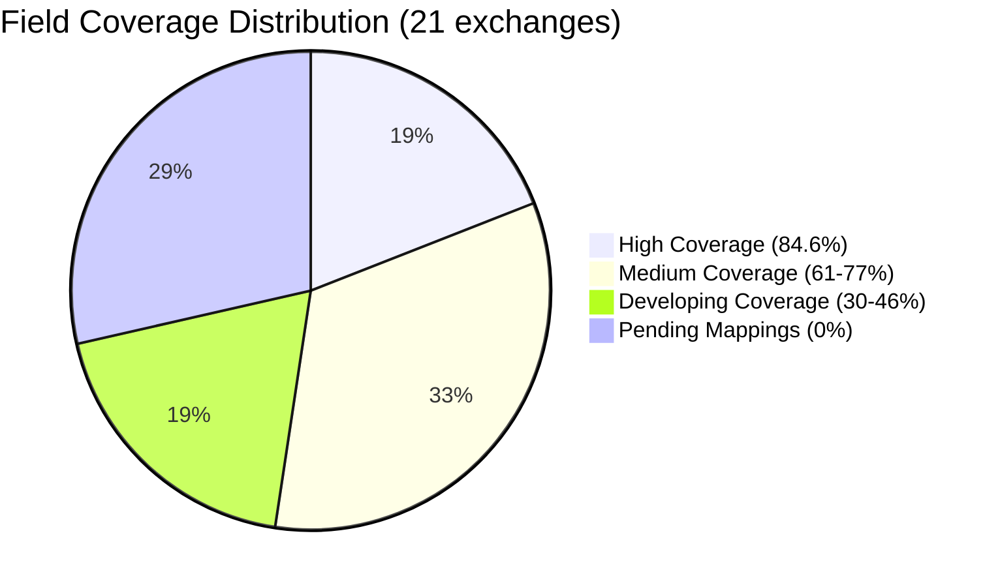
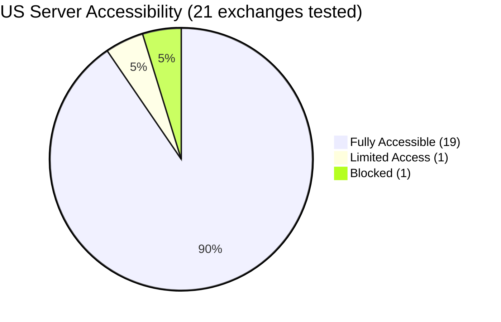
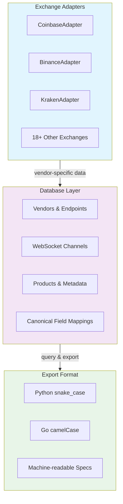
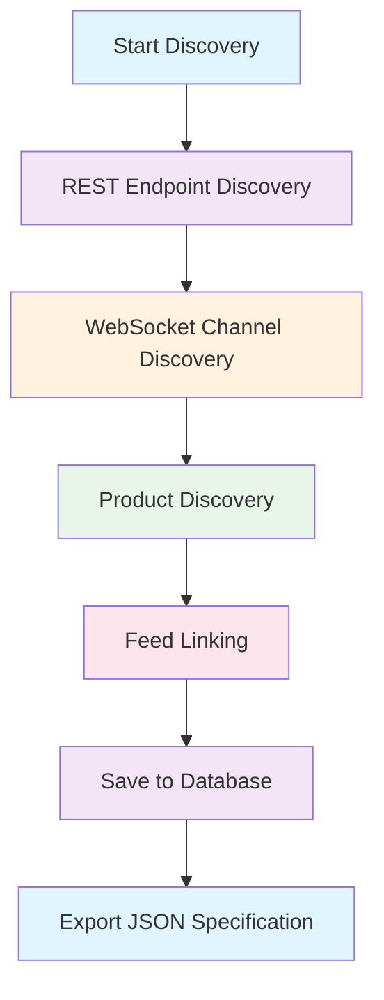

# Vendor API Specification Generator

[](https://www.python.org/downloads/)
[](https://opensource.org/licenses/MIT)
[](https://www.python.org/dev/peps/pep-0008/)
[](https://github.com/jsoprych/crypto-exchange-api-catalog)

A robust, extensible system for discovering and cataloging cryptocurrency exchange APIs. Generates machine-readable JSON specifications for use in data ingestion applications.

---

## ⚠️ IMPORTANT DISCLAIMER

**THIS IS EXPERIMENTAL SOFTWARE FOR INFORMATIONAL PURPOSES ONLY.**

- **NOT a trading system** - This software provides API catalog information only
- **NO WARRANTY** - Provided "as is" without guarantees of accuracy or completeness
- **NO LIABILITY** - Authors are not liable for trading losses or damages of any kind
- **NO FINANCIAL ADVICE** - Does not constitute investment, trading, or financial advice
- **USER RESPONSIBILITY** - You are solely responsible for verifying information and compliance with laws

**See [DISCLAIMER.md](DISCLAIMER.md) for complete legal terms. By using this software, you accept all risks and responsibilities.**

---

## Purpose

This tool produces a comprehensive JSON catalog/specification from vendor APIs (starting with Coinbase), enabling applications to:
- **Configure data subscriptions** (tick feeds, bar feeds, order books, etc.)
- **Understand available endpoints** and their parameters
- **Map vendor-specific fields** to internal abstractions
- **Track API changes** over time through audit trails

The JSON specification is designed for **code generation** and will be used by future data stream ingestion applications.

## Features

### Multi-Vendor Support
- **21 cryptocurrency exchanges** - Comprehensive API coverage with 24,395+ trading pairs
- **Top global exchanges** - Deribit (3,960 products), MEXC (2,719), Gate.io (2,568), Huobi (2,060)
- **Korean market leaders** - Upbit (689 products), Bithumb (planned)
- **US-regulated exchanges** - Coinbase (778), Kraken (1,405), Gemini (50), Bitstamp (292)
- **Asian market coverage** - LBank (1,511), WhiteBIT (1,060), OKX (724)
- **Derivatives specialists** - Deribit (options/futures), Bybit (perpetuals)
- **Ultimate goal** - Match CCXT's 100+ exchange coverage with unified field mappings

> **Exchange Coverage Progress:** Currently at 21/25 target exchanges (84% complete). System supports rapid expansion to 100+ exchanges matching CCXT coverage. All exchanges are accessible from US servers unless explicitly restricted (documented in `US_ACCESS_RESTRICTIONS_REPORT.md`).

> **Note for Binance Users:** The default configuration uses Binance.US endpoints (`api.binance.us`) which work for US-based users. If you're outside the US and want to use international Binance, update `config/settings.py` to use `api.binance.com` and `stream.binance.com:9443` instead.

### SQLite-Backed Storage
- **Queryable database** - Powerful SQL analysis of API specifications
- **Complete audit trail** - Track every discovery run
- **Change detection** - Automatically identify API changes
- **Versioning** - Historical tracking of API evolution

### Flexible JSON Export
- **Python/Go compatibility** - Configurable naming conventions (`snake_case` or `camelCase`)
- **Multiple output formats** - Per-vendor or unified multi-vendor specs
- **Schema validation** - Ensures consistent output structure

### Comprehensive Discovery
- **REST endpoints** - All HTTP methods, parameters, response schemas
- **WebSocket channels** - Subscribe/unsubscribe formats, message types
- **Products/symbols** - Trading pairs with metadata
- **Feed relationships** - Links products to available data feeds

### Canonical Field Mapping System (Phase 2+)
- **Vendor field normalization** - Map exchange-specific fields to canonical names
- **21 exchanges mapped** - All exchanges have WebSocket ticker mappings with average 45.4% coverage
- **190 field mappings** - Standardized ticker fields across all exchanges
- **High-coverage leaders** - Binance, Bitget, Bitmart, OKX (84.6% coverage each)
- **Array extraction** - Handle Kraken-style array fields (e.g., `a[0]`, `b[0]`)
- **Type transformations** - Automatic string→numeric, ms→datetime conversion
- **SQL-driven mappings** - All mappings stored in database, no code changes needed
- **Coverage analytics** - Real-time mapping coverage reports via `vendor_coverage_view`
- **US accessibility tracking** - Documented geo-restrictions for all exchanges

## Exchange Coverage Progress

### Current Status & CCXT Comparison

```mermaid
gantt
    title CCXT Parity Roadmap - Exchange Integration Timeline
    dateFormat YYYY-MM-DD
    axisFormat %Y-%m
    
    section Current Progress
    Phase 1: Core Exchanges (4) :done, 2024-01, 14d
    Phase 2: Field Mapping System :done, 2024-02, 21d
    Phase 3: Rapid Expansion (21) :done, 2024-02, 28d
    
    section Active Development
    Phase 4: 25 Exchange Target :active, 2024-03, 21d
    Field Coverage Optimization :active, 2024-03, 28d
    
    section Future Milestones
    Phase 5: 50 Exchange Milestone :2024-04, 30d
    Phase 6: 100+ Exchange Parity :2024-05, 45d
    Production Integration :2024-06, 30d
```

**Core Statistics:**
- **Exchanges Integrated**: 21/25 target exchanges (84% complete)
- **Trading Pairs**: 24,395+ products cataloged across all exchanges
- **Field Mappings**: 190 canonical field mappings with 45.4% average ticker coverage
- **CCXT Benchmark**: Currently at 21 exchanges vs CCXT's 100+ exchange library
- **Expansion Target**: Match CCXT's comprehensive coverage with superior field normalization

**Top Exchanges by Product Volume:**
1. **Deribit** - 3,960 products (options/futures specialist)
2. **MEXC** - 2,719 products
3. **Gate.io** - 2,568 products  
4. **Huobi** - 2,060 products
5. **LBank** - 1,511 products

**Field Coverage Leaders** (WebSocket ticker):



- **High Coverage (84.6%)**: Binance, Bitget, Bitmart, OKX
- **Medium Coverage (61-77%)**: Coinbase, Kraken, Bitfinex, Bitstamp, Crypto.com, Gate.io, Gemini
- **Developing Coverage (30-46%)**: Huobi, MEXC, Bybit, KuCoin
- **Pending Mappings**: Deribit, Phemex, Poloniex, LBank, WhiteBIT, Upbit

**Regional & Market Coverage:**
- **US-Regulated**: Coinbase, Kraken, Gemini, Bitstamp
- **Korean Market**: Upbit (689 products), Bithumb (planned)
- **Asian Markets**: LBank, WhiteBIT, OKX
- **European**: WhiteBIT, Bitstamp
- **Global**: Binance, MEXC, Gate.io, Huobi, KuCoin

**US Accessibility Status:**



All 21 exchanges have been tested for US server accessibility. Documented restrictions are available in `US_ACCESS_RESTRICTIONS_REPORT.md`. Key findings:
- **Bybit**: Strict US blocking (403 Forbidden via CloudFront)
- **Binance**: Regional restrictions (requires Binance.US for US customers)
- **All others**: Accessible from US servers

**Next Phase Goals:**
1. Reach 25 exchanges (current target)
2. Extend to 50+ exchanges (CCXT parity intermediate goal)
3. Achieve 100+ exchange coverage (ultimate CCXT matching)
4. Improve average field coverage to >65% across all exchanges
5. Add order_book, trade, candle data type mappings

**Why This Matters:**
While CCXT provides excellent exchange connectivity, this project focuses on **unified field normalization** and **US accessibility documentation**. The goal is to create a production-ready system where data from any exchange can be consumed with consistent field names and predictable accessibility.

## Installation

### Prerequisites
- Python 3.8+
- pip

### Setup

```bash
# Clone the repository
git clone https://github.com/jsoprych/crypto-exchange-api-catalog.git
cd crypto-exchange-api-catalog

# Create and activate virtual environment (recommended)
python3 -m venv venv
source venv/bin/activate  # On Windows: venv\Scripts\activate

# Install dependencies
pip install -r requirements.txt

# Initialize the database
python3 main.py init
```

### Rebuild Everything from Scratch

To perform a complete fresh build with all exchanges:

```bash
./rebuild.sh
```

This script will:
- Clean old data and output directories
- Initialize a fresh database
- Discover all 21 exchanges (Coinbase, Binance, Kraken, Bitfinex, OKX, KuCoin, Gate.io, Huobi, MEXC, Bitstamp, Bitget, BitMart, Crypto.com, Gemini, Poloniex, Deribit, Phemex, LBank, WhiteBIT, Upbit, Bybit)
- Export JSON catalogs in both snake_case and camelCase formats
- Generate summary of all discovered data

## Quick Start

```bash
# 1. Discover Coinbase API
python main.py discover --vendor coinbase

# 2. Export to JSON (Python format with snake_case)
python main.py export --vendor coinbase --format snake_case

# 3. Export to JSON (Go format with camelCase)
python main.py export --vendor coinbase --format camelCase --output output/coinbase_go.json

# 4. List all vendors
python main.py list-vendors

# 5. Query the database
python main.py query "SELECT * FROM products WHERE base_currency = 'BTC'"
```

## Architecture

### Three-Layer Design




```
┌─────────────────────────────────────────┐
│   Vendor Adapters (Extensible)         │
│   - CoinbaseAdapter                     │
│   - FutureVendorAdapter                 │
└──────────────┬──────────────────────────┘
               │ (vendor-specific data)
               ▼
┌─────────────────────────────────────────┐
│   SQLite Database (Source of Truth)     │
│   - Vendors, Endpoints, Channels        │
│   - Products, Audit Trail               │
└──────────────┬──────────────────────────┘
               │ (query & export)
               ▼
┌─────────────────────────────────────────┐
│   JSON Export (Code Generation Input)   │
│   - Python/Go format options            │
│   - Per-vendor or unified specs         │
└─────────────────────────────────────────┘
```

### Discovery Process



1. **REST Endpoint Discovery** - Identify all available HTTP endpoints
2. **WebSocket Channel Discovery** - Map all subscription channels
3. **Product Discovery** - Fetch trading pairs from live API
4. **Feed Linking** - Connect products to their available feeds

## Project Structure

```
crypto-exchange-api-catalog/
├── config/
│   └── settings.py              # Configuration management
├── src/
│   ├── adapters/
│   │   ├── base_adapter.py      # Abstract vendor interface
│   │   └── coinbase_adapter.py  # Coinbase implementation
│   ├── database/
│   │   ├── db_manager.py        # Database connection
│   │   └── repository.py        # Data access layer
│   ├── discovery/
│   │   └── spec_generator.py    # Discovery orchestration
│   ├── export/
│   │   └── json_exporter.py     # JSON export functionality
│   └── utils/
│       ├── logger.py            # Logging utilities
│       ├── http_client.py       # HTTP client with retry
│       └── naming.py            # snake_case ↔ camelCase
├── sql/
│   ├── schema.sql               # Database schema (DDL)
│   ├── queries/                 # Pre-built SQL queries
│   │   ├── 01_vendor_analysis.sql
│   │   ├── 02_endpoint_discovery.sql
│   │   └── 04_product_catalog.sql
│   └── views/
│       └── common_views.sql     # Useful database views
├── data/
│   └── specifications.db        # SQLite database
├── output/                      # JSON exports
├── main.py                      # CLI entry point
├── requirements.txt
└── README.md
```



```mermaid
graph TD
    ROOT[crypto-exchange-api-catalog] --> CONFIG[config/]
    ROOT --> SRC[src/]
    ROOT --> SQL[sql/]
    ROOT --> DATA[data/]
    ROOT --> OUTPUT[output/]
    ROOT --> MAIN[main.py]
    ROOT --> REQ[requirements.txt]
    ROOT --> README[README.md]
    
    CONFIG --> SETTINGS[settings.py]
    
    SRC --> ADAPTERS[adapters/]
    SRC --> DATABASE[database/]
    SRC --> DISCOVERY[discovery/]
    SRC --> EXPORT[export/]
    SRC --> UTILS[utils/]
    
    ADAPTERS --> BASE_ADAPTER[base_adapter.py]
    ADAPTERS --> COINBASE_ADAPTER[coinbase_adapter.py]
    ADAPTERS --> OTHER_ADAPTERS[20+ exchange adapters]
    
    DATABASE --> DB_MANAGER[db_manager.py]
    DATABASE --> REPOSITORY[repository.py]
    
    DISCOVERY --> SPEC_GENERATOR[spec_generator.py]
    
    EXPORT --> JSON_EXPORTER[json_exporter.py]
    
    UTILS --> LOGGER[logger.py]
    UTILS --> HTTP_CLIENT[http_client.py]
    UTILS --> NAMING[naming.py]
    
    SQL --> SCHEMA_SQL[schema.sql]
    SQL --> QUERIES[queries/]
    SQL --> VIEWS[views/]
    
    QUERIES --> VENDOR_ANALYSIS[01_vendor_analysis.sql]
    QUERIES --> ENDPOINT_DISCOVERY[02_endpoint_discovery.sql]
    QUERIES --> PRODUCT_CATALOG[04_product_catalog.sql]
    
    VIEWS --> COMMON_VIEWS[common_views.sql]
    
    DATA --> SPECIFICATIONS_DB[specifications.db]
    
    style ROOT fill:#e1f5fe
    style ADAPTERS fill:#f3e5f5
    style DATABASE fill:#fff3e0
    style DISCOVERY fill:#e8f5e8
    style EXPORT fill:#fce4ec
```

## Usage

### Command Reference

#### Initialize Database
```bash
python main.py init
```

Creates the database schema with all tables, indexes, and views.

#### Discover Vendor API
```bash
python main.py discover --vendor coinbase
```

Runs the complete discovery process:
- Fetches products from live API
- Maps REST endpoints
- Maps WebSocket channels
- Links products to feeds
- Stores everything in SQLite

**Output:**
```
Discovering Coinbase Exchange API...

✓ Discovery complete:
  - Products: 247
  - REST endpoints: 10
  - WebSocket channels: 5
  - Duration: 2.34s
  - Run ID: 1
```

#### Export Specification
```bash
# Python format (snake_case)
python main.py export --vendor coinbase --format snake_case

# Go format (camelCase)
python main.py export --vendor coinbase --format camelCase

# Custom output path
python main.py export --vendor coinbase --output my_spec.json
```

**Output JSON Structure:**
```json
{
  "spec_metadata": {
    "vendor": "coinbase",
    "display_name": "Coinbase Exchange",
    "spec_version": "1.0",
    "generated_at": "2026-01-26T18:00:00Z",
    "naming_convention": "snake_case",
    "base_url": "https://api.exchange.coinbase.com",
    "websocket_url": "wss://ws-feed.exchange.coinbase.com"
  },
  "rest_api": {
    "base_url": "https://api.exchange.coinbase.com",
    "endpoints": [
      {
        "path": "/products",
        "method": "GET",
        "authentication_required": false,
        "description": "Get a list of available currency pairs for trading",
        "query_parameters": {},
        "response_schema": {"type": "array"},
        "rate_limit_tier": "public"
      }
      // ... more endpoints
    ]
  },
  "websocket_api": {
    "url": "wss://ws-feed.exchange.coinbase.com",
    "channels": [
      {
        "channel_name": "ticker",
        "authentication_required": false,
        "description": "Real-time price updates for a product",
        "subscribe_format": {
          "type": "subscribe",
          "product_ids": ["BTC-USD"],
          "channels": ["ticker"]
        },
        "message_types": ["ticker", "subscriptions"]
      }
      // ... more channels
    ]
  },
  "products": [
    {
      "symbol": "BTC-USD",
      "base_currency": "BTC",
      "quote_currency": "USD",
      "status": "online",
      "available_rest_feeds": [
        {
          "type": "ticker",
          "endpoint": "/products/{product_id}/ticker",
          "method": "GET"
        },
        {
          "type": "candles",
          "endpoint": "/products/{product_id}/candles",
          "method": "GET",
          "intervals": [60, 300, 900, 3600, 21600, 86400]
        }
      ],
      "available_ws_channels": ["ticker", "level2", "matches", "heartbeat"]
    }
    // ... more products
  ]
}
```

#### Query Database
```bash
# List all products
python main.py query "SELECT symbol, base_currency, quote_currency FROM products"

# Find BTC pairs
python main.py query "SELECT * FROM products WHERE base_currency = 'BTC'"

# Show discovery run history
python main.py query "SELECT * FROM discovery_runs ORDER BY run_timestamp DESC"
```

### SQL Query Library

The `sql/queries/` directory contains pre-built queries for common analysis tasks:

#### Vendor Analysis
```bash
sqlite3 data/specifications.db < sql/queries/01_vendor_analysis.sql
```

- List all vendors with API coverage
- Most recently updated vendors
- Vendor health check

#### Endpoint Discovery
```bash
sqlite3 data/specifications.db < sql/queries/02_endpoint_discovery.sql
```

- All REST endpoints for a vendor
- Public vs authenticated endpoints
- Recently added/deprecated endpoints

#### Product Catalog
```bash
sqlite3 data/specifications.db < sql/queries/04_product_catalog.sql
```

- All active products
- Products available on multiple vendors
- Products with specific feeds (candles, ticker, etc.)

### Using Views

The database includes pre-built views for easier querying:

```sql
-- Active API surface across all vendors
SELECT * FROM v_active_api_surface;

-- Product feed availability
SELECT * FROM v_product_feed_availability WHERE symbol = 'BTC-USD';

-- Latest discovery runs
SELECT * FROM v_latest_discovery_runs;

-- Recent API changes
SELECT * FROM v_recent_api_changes;
```

## Configuration

Edit `config/settings.py` to customize:

### Output Format
```python
OUTPUT_CONFIG = {
    "naming_convention": "snake_case",  # or "camelCase"
    "include_vendor_metadata": True,
    "schema_version": "1.0",
    "pretty_print": True,
    "indent": 2
}
```

### Vendor Configuration
```python
VENDORS = {
    "coinbase": {
        "enabled": True,
        "base_url": "https://api.exchange.coinbase.com",
        "websocket_url": "wss://ws-feed.exchange.coinbase.com",
        # ... more config
    }
}
```

## Adding a New Vendor

1. **Create adapter** in `src/adapters/new_vendor_adapter.py`:

```python
from src.adapters.base_adapter import BaseVendorAdapter

class NewVendorAdapter(BaseVendorAdapter):
    def discover_rest_endpoints(self):
        # Implement endpoint discovery
        pass
    
    def discover_websocket_channels(self):
        # Implement channel discovery
        pass
    
    def discover_products(self):
        # Implement product discovery
        pass
```

2. **Add configuration** to `config/settings.py`:

```python
VENDORS["new_vendor"] = {
    "enabled": True,
    "display_name": "New Vendor Exchange",
    "base_url": "https://api.newvendor.com",
    # ... more config
}
```

3. **Update spec_generator.py** to recognize the new adapter:

```python
def _create_adapter(self, vendor_name, vendor_config):
    if vendor_name == 'coinbase':
        return CoinbaseAdapter(vendor_config)
    elif vendor_name == 'new_vendor':
        return NewVendorAdapter(vendor_config)
```

4. **Run discovery**:

```bash
python main.py discover --vendor new_vendor
python main.py export --vendor new_vendor
```

## Design Principles

### Modular Design
- Functions <50 lines (enforced through design)
- Clear separation of concerns
- Reusable components

### Documentation
- Every function has a docstring
- First line of each file: comment with filename
- Meaningful inline comments

### Error Handling
- Fail-fast on critical errors
- Graceful degradation for optional data
- Comprehensive logging

### Extensibility
- New vendors: Inherit from `BaseVendorAdapter`
- New feed types: Configuration-driven
- New intervals: No hardcoding
- Custom transformations: Plugin system ready

## Future Roadmap & CCXT Parity Goals

### Phase 4: Comprehensive Exchange Coverage (100+ Exchanges)
- **Current Status**: 21 exchanges integrated, 24,395+ trading pairs cataloged
- **Short-term Goal**: Reach 25 exchanges (84% complete of initial target)
- **Medium-term Goal**: Achieve 50+ exchanges (CCXT parity intermediate milestone)
- **Ultimate Goal**: Match CCXT's 100+ exchange coverage with superior field normalization
- **Automated Expansion**: Use `add_exchange.py` automation for rapid addition of new exchanges
- **Geographic Coverage**: Expand to LATAM (Bitso), India (WazirX), Japan (Coincheck, Liquid), Europe (HitBTC)

### Phase 5: Enhanced Field Mapping System
- **Extend data types**: Complete order_book, trade, candle mappings for all exchanges
- **Improve coverage**: Target >65% average field coverage across all exchanges
- **Derivatives support**: Add futures, perpetuals, and options-specific field mappings
- **REST endpoint mappings**: Map all public REST endpoints to canonical fields
- **Automated mapping generation**: Machine learning-assisted field matching

### Phase 6: Production Integration & Enterprise Features
- **Authenticated endpoints**: Support for private API endpoints (account, orders, fills)
- **Real-time monitoring**: Exchange API health monitoring and change detection
- **Performance optimization**: Database indexing for large-scale product catalogs
- **Enterprise deployment**: Docker containers, Kubernetes orchestration, monitoring dashboards
- **API Gateway**: Unified REST/WebSocket interface for all exchanges

### CCXT Comparison & Competitive Advantage
- **CCXT Coverage**: 100+ exchanges, excellent connectivity, language bindings
- **This Project's Focus**: Unified field normalization, US accessibility documentation, SQL-driven mappings
- **Key Differentiators**: 
  - **Field Consistency**: Canonical field names across all exchanges
  - **Accessibility Tracking**: Documented geo-restrictions and US access status
  - **SQL Analytics**: Powerful querying of exchange specifications
  - **Rapid Expansion**: Automation system for 90% faster exchange integration
  - **Production Readiness**: Designed for trading daemons and data pipelines

### WebSocket Testing & Validation
- Live WebSocket connection testing with real-time message capture
- Automated validation of WebSocket message formats
- Connection stability and reconnection testing
- Latency and performance benchmarking

### Documentation & Standards Alignment
- Automated API documentation scraping and parsing
- OpenAPI/Swagger spec generation for each exchange
- Alignment with institutional standards (FIX, Bloomberg, ISO 20022)
- Comprehensive API change tracking and versioning

## Database Schema

The SQLite database contains 17 tables:

### Core Catalog Tables (11)
- **vendors** - Vendor registry
- **discovery_runs** - Audit trail of discovery runs
- **rest_endpoints** - REST API endpoints
- **websocket_channels** - WebSocket channels
- **products** - Trading pairs/symbols
- **product_rest_feeds** - Product → REST feed links
- **product_ws_channels** - Product → WebSocket channel links
- **api_changes** - Change tracking
- **spec_versions** - Specification version history

### Canonical Mapping Tables (6) - Phase 2
- **canonical_fields** - Industry-standard field definitions (26 fields)
- **canonical_data_types** - Data type templates (ticker, order_book, trade, candle)
- **field_mappings** - Vendor → canonical field mappings (82 mappings: 49 WebSocket + 33 REST across 4 exchanges)
- **data_type_fields** - Data type field requirements (36 requirements)
- **mapping_validation** - Validation tracking and quality metrics
- **Plus 2 views**: `vendor_mappings_view` and `vendor_coverage_view` for easy querying

See `sql/schema.sql` for core DDL and `sql/mapping_schema.sql` for canonical mapping tables.

**For comprehensive database documentation including schema details, usage examples, and integration guides, see [DATABASE-CONTEXT.md](data/DATABASE-CONTEXT.md).**

## Logging

Logs are written to:
- **Console**: INFO level and above
- **File**: `api_spec_generator.log` (DEBUG level)

Log format:
```
2026-01-26 18:00:00 [INFO] src.discovery.spec_generator: Starting API specification generation for coinbase
```

## License

MIT License - Copyright © 2026 John Soprych / Elko.AI

See [LICENSE](LICENSE) file for full details.

**IMPORTANT:** This license grants permission to use the software, but **DOES NOT** provide any warranties or accept any liability. See [DISCLAIMER.md](DISCLAIMER.md) for complete legal terms.

## Contributing

See [CONTRIBUTING.md](CONTRIBUTING.md) for detailed contribution guidelines.

By contributing, you agree that your contributions will be licensed under the MIT License and that you accept the terms in [DISCLAIMER.md](DISCLAIMER.md).

## Support

For issues or questions:
- **Bug Reports**: [File an issue](https://github.com/jsoprych/crypto-exchange-api-catalog/issues)
- **Feature Requests**: [Submit a request](https://github.com/jsoprych/crypto-exchange-api-catalog/issues/new?template=feature_request.md)
- **Vendor Requests**: [Request new exchange](https://github.com/jsoprych/crypto-exchange-api-catalog/issues/new?template=vendor_request.md)

---

## Legal Notice

**EXPERIMENTAL SOFTWARE - USE AT YOUR OWN RISK**

This software is provided for informational and educational purposes only. It is not a trading system, does not provide financial advice, and the authors accept no liability for trading losses or damages. Cryptocurrency trading involves substantial risk. See [DISCLAIMER.md](DISCLAIMER.md) for complete legal terms.

By using this software, you acknowledge that you have read, understood, and agree to be bound by the terms in the disclaimer.
